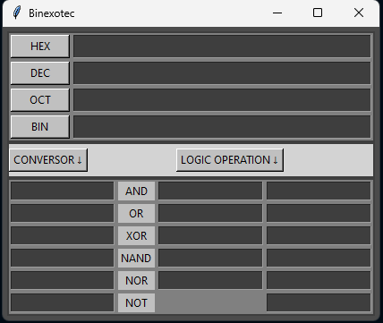

# Binexotec

**Binexotec** es un conversor básico que permite realizar conversiones entre los siguientes sistemas numéricos:

- **BIN** (Binario)
- **HEX** (Hexadecimal)
- **OCT** (Octal)
- **DEC** (Decimal)

Además, el programa incluye operaciones lógicas.

## Instalación

Se requiere descargar front_end.py,back_end,py binexotec.pyw

Se requiere la version de python 3.10 + y Tkinter (libreria nativa de python)

## Start

Ejecutar el archivo con extencion .pyw
Se ejecutara sin consola de commando.

## Licencia

Este proyecto está licenciado bajo la [GNU General Public License v3.0](https://www.gnu.org/licenses/gpl-3.0.html).

## in building

Solo funciona solo  el conversor, aun esta en desarrollo la parte logica
